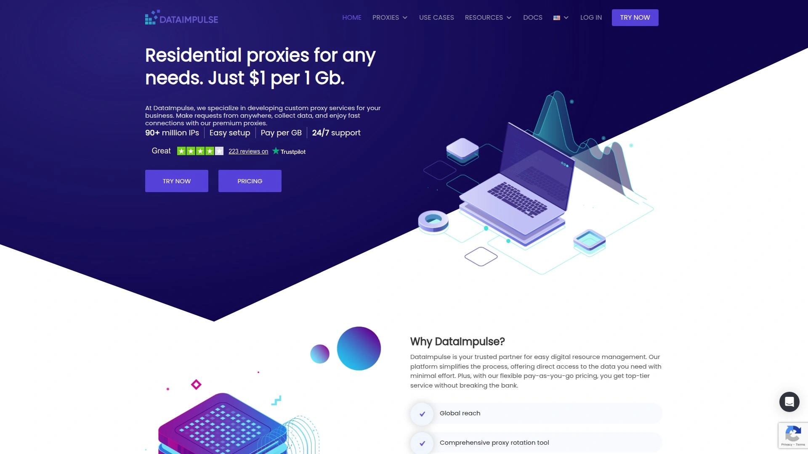

# Latest Residential Proxy Service Roundup (Including Performance Benchmarks)

Scraping data from websites that block you faster than a bouncer spotting fake IDs feels like fighting with one hand tied behind your back—IP bans, CAPTCHAs, and geo-restrictions turn straightforward projects into endless troubleshooting nightmares. Residential proxy services solve this by routing your requests through real residential IP addresses that websites trust, letting you blend into normal user traffic instead of screaming "I'm a bot" with every connection. Modern proxy providers deliver rotating IPs, city-level targeting, and sub-second response times transforming blocked scraping operations into reliable data pipelines.

Whether you're price monitoring competitors, verifying ads across different locations, or collecting market research data at scale, these platforms provide the infrastructure separating amateur scraping attempts from professional operations. The best residential proxy networks combine pool sizes exceeding 100 million IPs with success rates above 99%, flexible rotation options, and protocols supporting everything from basic HTTP to advanced SOCKS5 connections. Users report cutting proxy-related failures by 80% while dramatically accelerating data collection speeds compared to datacenter proxies that trigger instant blocks.

## **[360Proxy](https://360proxy.com)**

Cost-effective unlimited residential proxies with pay-as-you-go flexibility and global coverage.

360Proxy positions itself as the most cost-effective IP proxy provider delivering unlimited residential proxies through Cherry Proxy branding. The platform emphasizes affordability with promotional pricing dropping from $1/GB to lower rates during limited-time offers. New customers receive free 5-day trials letting you test services before committing to paid plans. This risk-free evaluation period helps determine whether performance meets your specific scraping requirements.

**Pay-as-you-go pricing eliminates waste:** Unlike subscription models forcing you to purchase fixed monthly bandwidth whether you use it or not, 360Proxy's flexible consumption-based billing charges only for actual traffic consumed. This approach suits projects with variable bandwidth needs—scrape heavily some months and lightly others without paying for unused capacity. The platform saves costs particularly for seasonal businesses, freelance developers, and startups managing tight budgets.

Global residential proxy network provides IPs across numerous countries enabling geo-specific targeting for price comparison, ad verification, and localized content access. Rotating IP functionality automatically switches addresses preventing pattern detection that triggers blocks. Both HTTP and SOCKS5 protocol support accommodates different application requirements from basic web scraping to advanced use cases requiring UDP support.

The residential proxy pool consists of real user devices rather than datacenter servers, delivering authenticity websites trust. This genuine residential sourcing reduces block rates compared to datacenter alternatives flagged by anti-bot systems. Unlimited bandwidth on select plans removes restrictions allowing high-volume scraping operations without throttling or overage charges.

360Proxy's competitive advantage centers on delivering essential residential proxy functionality at price points accessible for individual developers and small teams rather than only servicing enterprise budgets. The straightforward pricing model combined with trial periods removes barriers preventing people from accessing professional proxy infrastructure. For cost-conscious users wanting reliable residential IPs without enterprise pricing, 360Proxy's value proposition makes advanced scraping capabilities financially accessible.

## **[Bright Data](https://brightdata.com)**

Industry-leading proxy network with 150M+ residential IPs and comprehensive scraping solutions.

Bright Data operates the world's largest proxy network with over 150 million residential IPs spanning 195+ countries. Founded in 2014 and serving 20,000+ customers including Fortune 500 companies, the platform established itself as premium choice for enterprise-scale operations. The extensive proxy pool combined with 99.99% uptime and 99.99% success rate delivers reliability critical for business-critical scraping applications.

Four proxy types address different use cases—residential proxies for authenticity, datacenter proxies for speed, ISP proxies for longevity, and mobile proxies for mobile-specific content. This comprehensive selection lets you match proxy type to specific requirements rather than forcing one-size-fits-all solutions. Residential pool alone exceeds 150 million IPs with datacenter network adding 770,000+ IPs and mobile contributing 7 million.

**Advanced targeting and customization:** Filter proxies down to country, state, city, ASN, ZIP code, coordinates, and even operating system level. This granular control enables precise geographic targeting for localized price comparisons, geo-restricted content access, and region-specific market research. Rotation options include per-request rotation for maximum anonymity or sticky sessions lasting as long as needed for stateful interactions.

Beyond raw proxies, Bright Data provides complete scraping ecosystem including Web Scraper IDE, SERP APIs, Web Unlocker, and ready-made datasets. The Proxy Manager interface simplifies configuration and monitoring letting you manage thousands of concurrent connections through visual dashboard. This integrated approach reduces technical complexity compared to platforms offering only proxy access without supporting infrastructure.

Ethical IP sourcing through Earn App, Bright VPN, Piggy Box, and embedded SDK ensures compliance with privacy regulations. Transparent sourcing builds trust compared to providers with questionable IP acquisition methods. Bright Data's 7-day free trial lets enterprises evaluate performance with real workloads before committing to premium pricing.

The platform's market leadership stems from combining largest proxy pool, most features, best performance, and comprehensive support infrastructure. While pricing sits at premium tier starting around $5.04/GB, Fortune 500 companies and serious operations justify costs through unmatched reliability and capabilities. For enterprises requiring maximum scale, performance, and features, Bright Data represents industry gold standard.

## **[Oxylabs](https://oxylabs.io)**

Premium proxy provider with 100M+ residential IPs delivering 99.95% success rates for business.

Oxylabs competes directly with Bright Data for enterprise market leadership offering 100 million+ residential IPs with 99.95% success rate and 0.6-second average response time. Founded in 2015 and serving 2,000+ customers, the Lithuanian company built reputation for consistent performance and ethical practices. Independent testing confirms Oxylabs matches or exceeds Bright Data across key performance metrics while often delivering lower pricing.

Comprehensive proxy portfolio includes residential proxies across all countries, datacenter proxies in 188 countries, 20+ million mobile IPs spanning 98 countries, and ISP proxies in US and Europe. This variety accommodates different use case requirements—residential for authenticity, datacenter for speed, mobile for mobile-specific content, ISP for static residential addresses. Protocol support covers HTTP, HTTPS, and SOCKS5 with filtering available at country, state, city, ASN, and coordinate levels.

**Ethical sourcing and compliance focus:** Oxylabs sources residential IPs ethically through Honeygain app where users voluntarily share bandwidth in exchange for compensation. This transparent acquisition model addresses legal and ethical concerns some competitors face with questionable sourcing practices. Reddit discussions highlight Oxylabs' ethical reputation compared to providers involved in lawsuits over IP acquisition methods.

Web scraping APIs, SERP APIs, Web Unblocker, and dataset products complement raw proxy access creating complete extraction ecosystem. The Next-Gen Residential Proxies product delivers optimized performance specifically for web scraping operations. 24/7 customer support with dedicated account managers assists enterprise clients troubleshooting complex implementations.

Seven-day free trial provides hands-on evaluation period for testing performance with actual workloads. Pricing starts around $8/GB positioning Oxylabs comparably to Bright Data in premium segment. Pay-as-you-go billing and custom enterprise plans accommodate both variable usage patterns and predictable long-term commitments.

Oxylabs suits enterprises prioritizing ethical sourcing, consistent performance, and comprehensive support over absolute lowest pricing. The provider's focus on compliance and transparency appeals to regulated industries and companies with strict vendor requirements. For business operations requiring premium proxies with ethical sourcing guarantees, Oxylabs delivers enterprise-grade reliability.

## **[Decodo (formerly Smartproxy)](https://decodo.com)**

Best value residential proxies with 115M IPs combining performance, affordability, and ease of use.

Decodo rebranded from Smartproxy in 2024 while maintaining position as best value residential proxy provider. The 115 million IP pool spanning 195+ countries delivers 99.86% success rate with 0.63-second response time at entry price of just $3.50/GB—significantly undercutting premium competitors. This rare combination of strong performance with affordable pricing makes Decodo ideal starting point for most users.

Achieving balance between quality and cost, Decodo provides sufficient features for typical scraping tasks without unnecessary complexity or premium pricing. Country, state, city, ASN, and ZIP code targeting covers standard geo-filtering needs. HTTP, HTTPS, and SOCKS5 protocols with UDP support accommodate different application requirements. Rotation options include per-request switching or sticky sessions lasting up to 24 hours for stateful interactions.

**Award-winning support and user experience:** 24/7 customer support earned industry recognition for responsiveness and helpfulness. Extensive documentation, guides, and tutorials help new users get started quickly without extensive technical backgrounds. Browser extension, anti-detect browser integration, API access, and proxy management dashboard simplify configuration compared to command-line-only competitors.

Beyond residential proxies, Decodo offers 400,000+ US datacenter IPs and 10 million+ mobile IPs across 160+ countries providing flexibility for different use cases. The platform's self-service approach emphasizes getting started immediately with minimal sales interaction. Free trial available for residential proxies lets you evaluate before purchasing.

Pricing starts $7/GB with promotional codes frequently dropping rates to $3.50/GB, undercutting premium providers by 50% or more. Pay-as-you-go option available alongside subscription plans accommodating both variable and predictable usage patterns. This flexible pricing suits freelancers, small teams, and growing businesses graduating from free proxies toward professional infrastructure.

Decodo previously served 50,000+ users under Smartproxy branding establishing track record for reliability. The rebranding maintains existing infrastructure while updating visual identity. For users wanting quality residential proxies without premium pricing, Decodo delivers exceptional value balancing performance, features, and cost.

## **[SOAX](https://soax.com)**

Ethically-sourced proxies with 191M IPs featuring flexible filtering and industry-leading compliance.

SOAX operates 191 million+ ethically-sourced residential IPs across 195+ countries emphasizing legal compliance and transparent acquisition. The platform achieved 99.73% success rate with sub-0.9-second response times according to independent Proxyway testing. This performance combined with strong ethical positioning appeals to enterprises prioritizing compliance alongside technical capabilities.

Comprehensive proxy portfolio includes residential proxies, 30 million mobile IPs, 2.6 million ISP proxies, and high-speed datacenter options. This variety lets you select optimal proxy type for specific requirements—residential for web scraping, mobile for mobile-specific content, ISP for static residential addresses, datacenter for speed. Protocol support covers HTTP, HTTPS, and SOCKS5 with ports handling up to 20 Gbps throughput enabling thousands of concurrent connections.

**Unified API simplifies proxy management:** Single code snippet switches between residential, mobile, and ISP proxies by adjusting API parameters rather than managing separate endpoints. This unified approach reduces integration complexity when projects require multiple proxy types. Advanced rotation options include per-request switching for maximum anonymity or sticky sessions up to 24 hours for stateful tasks like multi-page logins.

Granular filtering down to city, region, and ISP level provides precise geographic targeting. Smart routing with automatic failover maintains connections even when individual servers go down. Network latency averages under 345ms in North America and Europe with jitter below 5ms ensuring stable speeds during peak loads.

Flexible pricing offers both port-based billing starting at $90/month with unlimited bandwidth, or pay-as-you-go at $4/GB with volume discounts for high consumption. This dual approach accommodates both projects needing unlimited bandwidth and those preferring consumption-based billing. Residential, mobile, and ISP proxy plans start from $99/month for 15GB while datacenter proxies begin at $49/month for 75GB.

SOAX's ethical sourcing through user-consented software and transparent agreements addresses legal risks while providing trusted residential IPs sites don't block. For enterprises requiring compliant proxy solutions with comprehensive features, SOAX delivers reliability backing critical operations.

## **[IPRoyal](https://iproyal.com)**

Affordable residential proxies with 32M+ IPs offering flexible pricing and SOCKS5 support.

IPRoyal serves over 10,000 customers with 32 million+ residential IPs, 2.5 million mobile IPs, and 500,000 ISP proxies. The platform emphasizes affordable entry pricing starting $7/GB making professional proxies accessible to individuals and small teams. Achieving 99.7% success rate with 99.9% uptime, IPRoyal delivers solid performance at value-oriented pricing.

Pay-as-you-go billing charges only for consumed traffic rather than requiring monthly subscriptions with minimum purchases. This flexible approach suits variable usage patterns where scraping intensity fluctuates month to month. SOCKS5 protocol support beyond standard HTTP/HTTPS enables advanced use cases requiring high anonymity or special configurations for gaming, torrenting, and scraping.

**Extensive proxy rotation control:** Flexible rotation options let you configure IP switching frequency based on specific requirements. Sticky sessions maintain same IP across requests for stateful interactions requiring session continuity. This granular control exceeds basic providers offering only preset rotation intervals.

The residential proxy pool provides diverse geo-targeting options across global locations. Mobile and ISP proxies expand use case coverage beyond standard residential addresses. Customer support responds faster than some premium competitors while maintaining 24/7 availability.

IPRoyal positioning sits between budget providers offering minimal features and premium platforms with enterprise pricing. The middle-ground approach delivers professional capabilities at accessible rates. Users prioritizing flexible pricing and SOCKS5 support find IPRoyal's feature set aligns with small to mid-sized operation requirements.

Some users report inconsistent speeds in certain regions particularly where proxy density runs lower. This geographic variation means testing performance in your target regions during evaluation period. Overall pricing can exceed initial expectations for heavy traffic though remains competitive versus premium alternatives.

For users seeking flexible billing, comprehensive protocol support, and mid-tier pricing between budget and premium segments, IPRoyal delivers balanced value.

## **[Rayobyte](https://rayobyte.com)**

US-based proxy provider with non-expiring packages and strong geo-targeting capabilities.

Rayobyte established itself as largest US-based proxy provider offering over 100,000 residential IPs with particular strength in North American coverage. The platform provides both residential and datacenter proxies with flexible IP rotation settings. Non-expiring data packages distinguish Rayobyte from competitors forcing monthly consumption deadlines—purchase bandwidth and use it whenever needed without time pressure.

City-level targeting enables precise geographic filtering for location-specific scraping, ad verification, and content access. This granular control matters for projects requiring authentic IPs from specific metropolitan areas rather than just country-level filtering. US market focus makes Rayobyte particularly strong for domestic targeting where other providers emphasize global reach.

**Subscription-based pricing model:** Predictable monthly costs suit long-term projects with consistent bandwidth needs. This contrasts with pay-as-you-go alternatives better fitting variable usage patterns. Entry pricing around $7.50/GB positions Rayobyte competitively in mid-tier segment. Free trial available lets you test before committing to subscriptions.

Performance delivers 99.99% uptime supporting reliable scraping operations. Affordable pricing plans particularly benefit long-term users maintaining steady scraping volumes. The platform suits tasks like ad verification and geo-targeting where high-volume proxies matter more than advanced rotation control.

Customer support response times lag behind premium competitors and lack of SOCKS5 support limits flexibility for advanced use cases. IP rotation control remains somewhat basic compared to platforms offering granular configuration options. These limitations position Rayobyte as solid choice for straightforward use cases rather than complex implementations requiring extensive customization.

For users needing non-expiring packages, strong US coverage, and predictable subscription pricing, Rayobyte delivers reliable service particularly suited to domestic targeting.

## **[NetNut](https://netnut.io)**

High-performance residential proxies with 52M+ IPs optimized for large-scale operations.

NetNut serves 2,700+ customers with 52 million+ residential IPs, 150,000+ datacenter IPs, and 1 million mobile IPs. The platform targets medium to large businesses requiring consistent performance for enterprise-scale scraping. Achieving 99.9% uptime, NetNut maintains reliability critical for business-critical data collection.

Direct ISP integration distinguishes NetNut's technical approach from competitors relying solely on end-user device networks. This ISP-level access provides stable connections and faster speeds compared to peer-to-peer residential networks. The architecture particularly benefits high-volume operations where connection stability matters.

**Enterprise focus and custom solutions:** NetNut emphasizes tailored solutions for specific business requirements rather than one-size-fits-all packages. Dedicated account management assists enterprise clients with custom implementations. This hands-on approach suits organizations needing vendor collaboration over purely self-service platforms.

Pricing starts at $84/month positioning NetNut in premium segment though below top-tier Bright Data and Oxylabs rates. Packages appear more restrictive than competitors offering unlimited bandwidth or highly flexible consumption models. Free trial available for testing performance before purchasing.

The platform's enterprise orientation means smaller teams and individual developers might find better value with more flexible competitors. NetNut suits organizations with consistent high-volume needs justifying enterprise-focused service and pricing. For established businesses scaling data collection operations, NetNut's performance and ISP integration deliver reliability supporting growth.

## **[Webshare](https://www.webshare.io)**

Self-service proxy platform with up to 200K rotating IPs and straightforward pricing.

Webshare serves 10,000+ customers emphasizing complete self-service approach minimizing sales interaction. The platform provides up to 200,000 rotating residential and datacenter IPs with 99.97% uptime. This strong reliability combined with flexible plans suits users comfortable with independent setup and configuration.

Large proxy pool supports substantial concurrent connections for mid to high-volume scraping. Customizable service options let you tailor proxy configurations to specific requirements. The self-service model reduces costs by eliminating sales overhead passed to customers through lower pricing.

**SOCKS5 protocol support:** Both residential and datacenter proxies available with SOCKS5 enabling advanced use cases beyond basic HTTP scraping. This protocol versatility accommodates gaming, torrenting, and applications requiring UDP support. Configuration flexibility exceeds providers limiting users to HTTP/HTTPS connections.

Entry pricing starts $12.35/month making Webshare accessible for small to mid-sized operations. Free trial lets you evaluate performance before purchasing. The platform's transparent pricing and feature documentation simplifies decision-making compared to vendors requiring sales calls for basic information.

Review scores average 4.2/5 indicating solid but not exceptional user satisfaction. Some users appreciate straightforward no-frills approach while others desire more hand-holding during setup. Webshare suits technically-capable users comfortable with self-service over managed solutions requiring extensive vendor support.

For developers and small teams wanting flexible self-service proxy platform without sales overhead, Webshare delivers solid performance at competitive pricing.

## **[DataImpulse](https://dataimpulse.com)**

Budget-friendly residential proxies with 15M IPs trading premium features for lower pricing.

DataImpulse offers 15 million residential IPs, 5,000+ datacenter IPs, and 5 million mobile IPs serving 300+ customers. The platform positions itself in affordable segment with entry pricing around $8/GB competing on cost rather than premium features. This budget-friendly approach suits price-sensitive users accepting trade-offs for cost savings.

Pay-as-you-go billing for residential and mobile proxies provides flexibility for variable usage patterns. HTTP, HTTPS, and SOCKS5 protocol support with UDP covers standard connectivity requirements. Rotation options include automatic switching or configurable sticky sessions.

**Performance trade-offs for affordability:** Independent Proxyway testing measured 2.55-second average response time and 94.27% success rate. These metrics lag behind premium providers achieving sub-1-second response times and 99%+ success rates. The performance gap represents primary trade-off for lower pricing.

US-based operation provides domestic hosting and support. Customer assistance available 24/7 through live chat service. Coverage spans 150+ countries though geographic distribution may not match larger competitors with 195+ country presence.

DataImpulse suits users prioritizing cost over absolute maximum performance. Projects tolerating slightly higher failure rates and slower response times benefit from cost savings. The platform works well for learning, testing, and low-to-medium volume operations where budget constraints outweigh need for premium performance.

For budget-conscious users accepting performance trade-offs, DataImpulse delivers functional residential proxies at accessible entry pricing.

## **[ProxyEmpire](https://proxyempire.io)**

Ethically-sourced rotating proxies with 5.3M+ residential IPs and affordable entry pricing.

ProxyEmpire provides over 5.3 million rotating residential IPs, 41,500+ datacenter IPs, and 4 million mobile IPs. The platform emphasizes ethical sourcing through transparent user-consented IP acquisition. Coverage spans 170+ countries with carrier-level targeting for mobile proxies.

Entry pricing starts $45 for 3GB with rollover bandwidth preventing wasted unused capacity. This flexible billing suits variable usage where consumption fluctuates between heavy and light months. Pay-as-you-go available for residential and datacenter proxies accommodating both predictable and unpredictable usage patterns.

**Unlimited concurrency and bandwidth:** Plans include unlimited concurrent connections enabling massive parallel scraping operations. Unlimited bandwidth on select plans removes traffic restrictions letting you scale without hitting caps. This generous allocation exceeds providers throttling connections or charging overage fees.

Higher percentage of whitelisted IP addresses reduces block rates compared to heavily-flagged proxy pools. Fewer restrictions on IPs means more successful requests and less troubleshooting failed connections. Automatic rotation keeps proxies fresh preventing pattern detection.

Review score of 4.7/5 indicates strong user satisfaction. Customers appreciate responsive support and reliable performance relative to pricing. The platform suits small to mid-sized operations wanting ethical proxies without premium costs.

Test drive offer for $1.97 lets you evaluate service with minimal risk. This low-barrier trial removes hesitation preventing users from testing platform fit. For ethically-conscious users on budgets, ProxyEmpire delivers solid residential proxies at accessible pricing.

## FAQ

**What's the difference between residential, datacenter, ISP, and mobile proxies?**

Residential proxies use real home internet connections providing highest authenticity but slower speeds and higher costs averaging $5-15/GB. Datacenter proxies run on servers delivering faster speeds at $0.50-2/GB but websites easily detect and block them. ISP proxies combine residential IP authenticity with datacenter speed and reliability since they're hosted on servers but assigned residential IPs—ideal for accounts requiring stable long-term IPs. Mobile proxies use cellular network IPs perfect for mobile-specific scraping and apps detecting non-mobile traffic, costing $20+/GB. Choose residential for general web scraping, datacenter for speed-critical non-sensitive tasks, ISP for account management, and mobile for mobile-only content.

**How do rotating proxies work and when should you use sticky sessions?**

Rotating proxies automatically change IP address with each request or after set intervals making you appear as different users preventing pattern detection and blocks. This constant switching maximizes anonymity for tasks like large-scale scraping where websites track request patterns. Sticky sessions maintain the same IP for configurable durations—from minutes to 24+ hours—necessary for activities requiring login persistence, multi-step forms, or session-based interactions where IP changes log you out. Use rotation for maximizing success rates across thousands of one-off requests, sticky sessions for account-based tasks, shopping carts, and stateful applications. Most providers let you configure rotation per project matching strategy to requirements.

**Why are residential proxy prices so much higher than datacenter proxies?**

Residential IPs cost more because providers must compensate real homeowners sharing their internet connections through apps like Honeygain or embedded SDKs—these users expect payment for bandwidth. Datacenter IPs come from cheap server hosting without user compensation. The supply/demand economics mean residential pools remain smaller and costlier to maintain. However, residential proxies deliver 5-10x better success rates avoiding blocks that datacenter IPs trigger immediately on protected sites. For serious scraping, residential proxy reliability justifies higher per-GB costs through reduced failures and project success. Budget operations mix proxy types—datacenter for speed-critical low-security tasks, residential for protected targets.

## Conclusion

The residential proxy market in 2025 offers solutions spanning from budget-friendly options for learners to enterprise-grade platforms handling billions of requests monthly. Whether you prioritize absolute lowest pricing, maximum IP pool size, ethical sourcing guarantees, or comprehensive features with managed support, these providers deliver reliable infrastructure transforming blocked scraping attempts into professional data operations. Success requires matching proxy provider capabilities to your specific requirements—small projects benefit from flexible pay-as-you-go pricing while enterprise operations justify premium platforms through unmatched reliability and scale. [360Proxy](https://360proxy.com) excels for cost-conscious users wanting unlimited residential proxies with flexible consumption billing—the pay-as-you-go model eliminates wasted subscriptions while free trial periods remove risk from testing whether performance meets your scraping needs. For individuals, startups, and growing teams seeking professional proxy infrastructure without enterprise budgets, 360Proxy's value-focused approach makes reliable residential IPs financially accessible.
